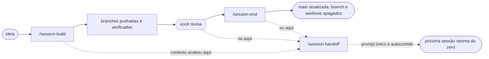
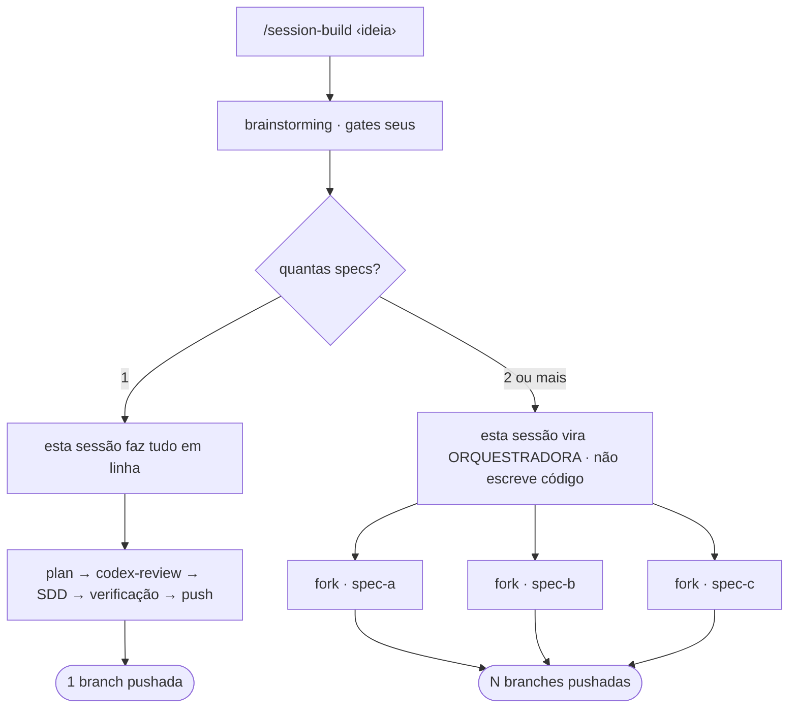
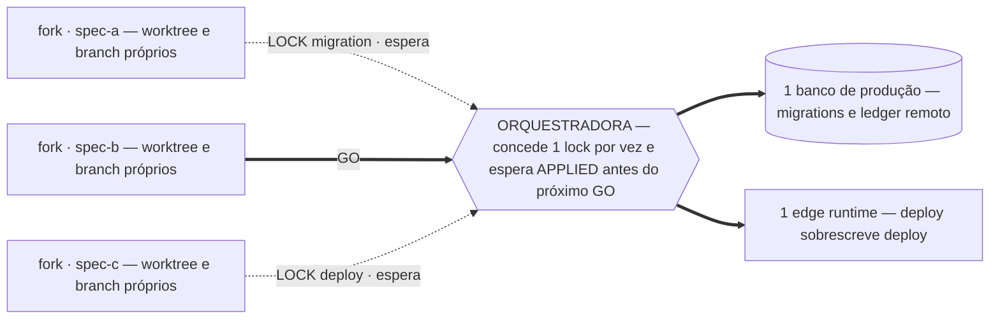
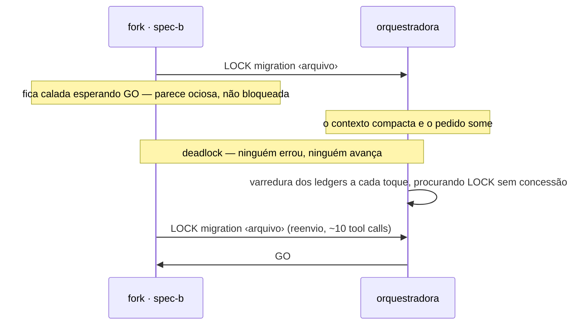
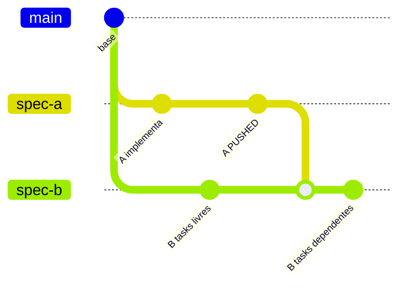
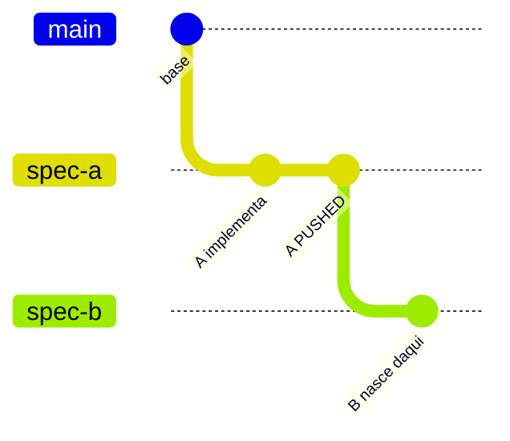
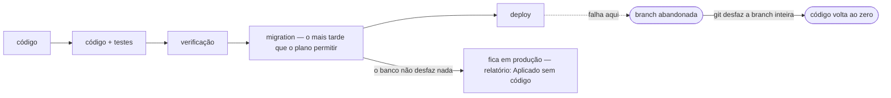
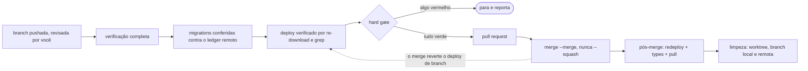
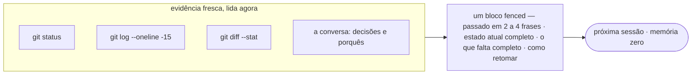

# A cadeia `session-*`

Três skills dividem o ciclo de vida de uma sessão de trabalho. Uma leva a ideia até branches prontas, outra leva a branch até a `main`, e a terceira mantém o trilho contínuo quando a sessão acaba no meio do caminho.

| Skill | Aresta que cruza | Estado terminal |
|---|---|---|
| [`session-build`](../skills/session-build/) | ideia → branch | N branches pushadas e verificadas |
| [`session-end`](../skills/session-end/) | branch → `main` | merge feito, produção em dia, branch e worktree apagados |
| [`session-handoff`](../skills/session-handoff/) | sessão → sessão | um prompt único e autocontido |

---

## O mapa

A confusão comum é achar que as três são etapas de uma mesma esteira. Não são. `build` e `end` ficam no mesmo trilho, em pontos diferentes, separados por uma coisa que nenhuma das duas faz: a sua revisão. `handoff` está em outro eixo — ele cruza o limite da sessão, e pode ser chamado em qualquer ponto do percurso.



Cada uma tem uma fronteira que nunca cruza:

- **`build` nunca** abre pull request, mergeia, ou chama `finishing-a-development-branch`. Nem "pra ajudar".
- **`end` nunca** abre trabalho novo. Bug achado no meio vira pendência escrita, não um fix improvisado.
- **`handoff` nunca** escreve de memória. Sem `git status` e `git log` lidos, não há handoff.

---

## `/session-build` — ideia → branch

Começa num brainstorm e termina em branches verificadas e pushadas.

> **Não é disparar e sair.** O run só fica autônomo quando o escopo fecha. Antes disso existem dois portões seus: o `brainstorming` exige que você aprove o design e revise cada spec, e o passo de escopo termina com você confirmando ordem e regras de colisão. Um run lançado e abandonado antes disso estaciona na primeira pergunta — corretamente, mas em silêncio.

### Uma spec ou várias

O brainstorm é quem decide o tamanho do trabalho. Se a ideia cabe num spec só, a própria sessão faz tudo em linha. Se ela se decompõe em vários, a sessão **forka a si mesma** — uma sessão filha por spec — e vira orquestradora, sem escrever uma linha de código a partir dali.



A diferença entre forkar e disparar um subagente comum é o que a filha sabe ao nascer: **o fork herda a conversa inteira**. Ela já viu o brainstorm, já conhece os outros specs e já sabe por que o dela existe. O prompt de despacho carrega só o que foi decidido *depois* do fork.

Cada filha é nomeada pelo slug do seu spec — `description: "spec ‹slug›"` é a única alavanca de nome que o `Agent` expõe, e esse valor vira o endereço dela no `ListAgents`. Sem isso, uma filha aparece como um handle hexadecimal aleatório no meio de dezenas de peers.

### O gargalo que o git não resolve

Worktree isola git. Não isola o banco de produção nem o edge runtime — esses continuam sendo um só para todas as sessões. É aí que duas branches paralelas se destroem em silêncio: a segunda a deployar a mesma edge function reverte a primeira, e nenhum teste local acusa.



A orquestradora existe para ser esse gargalo. A ordem de concessão vem da regra de colisão decidida no começo, não da ordem de chegada.

### As cinco fases de cada fork

1. **Plano** — `writing-plans` em `docs/superpowers/plans/`. Migrations e deploys entram como tasks explícitas do plano, cada uma com verificação própria; não são uma etapa separada depois.
2. **Codex review** — loop adversarial **sem teto**, com `rounds=until-approved`, até `APPROVED` e só até isso. O teto padrão de cinco rodadas termina num desempate humano, e desempate humano no meio de um fan-out para as outras filhas esperando alguém que pode estar dormindo. Se o argumento empacar — três rodadas seguidas com a mesma objeção e o plano intacto — a `codex-review` troca de tática (escreve a réplica dentro do plano, em vez de repeti-la no chat) e **continua**; o empaque é reportado como informação, nunca como pedido de permissão. O passo que ninguém pode pular: **copiar o plano endurecido de volta** para o caminho que a implementação lê. O `codex-review` trabalha dentro do run dir dele; sem o copy-back, você revisa um plano e implementa outro.
3. **Manifesto de superfícies** — a filha declara o que o plano endurecido vai tocar (migrations, tabelas, edge functions, módulos compartilhados, arquivos) e **para**. Nenhum `GO` sai antes do último manifesto chegar. E "para" aqui é literal: **a filha é one-shot, o turno dela acaba nesse ponto.** Ela não fica num loop esperando — quem a revive é a orquestradora, com uma nova mensagem. Uma filha esquecida parece idêntica a uma filha trabalhando.
4. **Implementação** — **em linha, tarefa por tarefa, dentro da própria filha.** `subagent-driven-development` não roda ali: o boilerplate de fork proíbe a ferramenta `Agent` por regra dura, que diretiva nenhuma sobrescreve, e sem subagente o mecanismo da skill não existe. O que se mantém é a disciplina dela — uma tarefa por vez, verificação da tarefa rodada antes de marcá-la feita, nada dado como pronto sem ler saída real. Só o caminho de spec única, que roda na sessão principal, usa SDD de verdade. Migration e deploy continuam só com lock concedido.
5. **Verificação e push** — lint, typecheck, build e testes rodados e *lidos* pela dona da branch. Relatório de subagente não conta como prova.

### O protocolo do cross-session chat

Filha fala com a orquestradora por `SendMessage to: "main"`; a orquestradora responde pelo nome. Toda filha também escreve os checkpoints no próprio arquivo de ledger — canal de reserva e registro durável depois de uma compactação.

| Mensagem | Direção | Significa |
|---|---|---|
| `SURFACES` | filha → orq. | o que meu plano vai tocar; estou parada esperando |
| `LOCK migration` | filha → orq. | preciso do banco; não aplico sem `GO` |
| `LOCK deploy` | filha → orq. | preciso do runtime; não deployo sem `GO` |
| `APPLIED` / `DEPLOYED` | filha → orq. | terminei e verifiquei; o lock está livre |
| `PUSHED` / `DONE` | filha → orq. | branch no remoto; libera quem dependia de mim |
| `BLOCKED` | filha → orq. | travei; escala para o humano |
| `GO` | orq. → filha | lock concedido ou dependência satisfeita |
| `HOLD` | orq. → filha | pare antes da próxima fase |
| `COORDINATE WITH` | orq. → filha | fale direto com a irmã e acordem dona e ponto de merge |
| `MERGE ‹branch› BEFORE ‹task›` | orq. → filha | traga a branch dela antes de tocar nisso |
| `REASSIGN` | orq. → filha | essa superfície não é mais sua |

### O único deadlock que o desenho produz sozinho

A regra de liveness — "filha muda uma fase inteira leva ping" — tem um ponto cego: **quem espera um `GO` fica calado por definição**. Parece ociosa, não bloqueada. Se o contexto da orquestradora compacta entre o pedido e a concessão, o pedido some e a filha espera para sempre, aparentando saúde perfeita.



Reenvio não é ruído: é sintoma de que uma concessão caiu.

### Quando o run precisa parar

`HOLD` vale no **próximo limite de fase**, nunca no meio. Uma filha segurando lock **termina a operação e solta antes de parar** — migration meio aplicada é pior que qualquer atraso que a parada tentava comprar. Depois, a orquestradora reporta o estado exato de cada filha: o que completou, o que segura, o que ia fazer.

### Dependência não é sim ou não — é quanto

| Nível | O que é | De onde a branch de B sai |
|---|---|---|
| **Independente** | nenhuma superfície em comum | da `main`, paralelo do começo ao fim |
| **Soft** | B só precisa conhecer a interface de A | da `main`; a orquestradora relaya a decisão |
| **Parcial** | só algumas tasks de B dependem de A | da `main`, **começa já** — plano ordenado com as tasks livres primeiro |
| **Total** | B importa A inteiro, ou o schema de A | **da branch de A**, depois do `PUSHED` |
| **Emaranhado** | as duas teriam que editar o mesmo código ao mesmo tempo | não é dependência: é erro de decomposição → vira 1 spec, 1 fork, em série |

**Parcial é o caso comum e o que paga** — B constrói enquanto A constrói, em vez de ficar ociosa:



**Total** é o único nível que troca a base da branch — e por isso é o que também define ordem de merge:



Duas regras fecham o assunto:

- **Duas sessões nunca dividem worktree, em nenhum nível.** Dependência é *temporal, não espacial*: quem espera o código do outro não conseguiria construir naquele diretório de qualquer jeito. Compartilhar não compraria paralelismo nenhum — só importaria disputa de `index.lock`, verificação lendo arquivo meio-escrito do vizinho, e gate falhando por quebra alheia.
- **O grafo precisa ser acíclico, e alguém precisa dizer isso em voz alta.** Qualquer ciclo é emaranhado por definição. Ciclo deixado no grafo trava o run, e trava *tarde*, depois das duas filhas já terem planejado e construído.

### O que não volta atrás

Git é descartável; banco de dados não. Existe um banco só, sem staging atrás dele. Se um fork aplica a migration e a implementação trava depois, a branch pode ser jogada fora — o que já entrou no schema fica.



Por isso a task de migration é ordenada o mais tarde possível, depois do código que depende dela estar escrito e verificado — e o relatório final tem uma seção só para nomear cada migration que ficou no banco com a branch abandonada. Essa seção vir vazia é uma afirmação, então só é feita depois de conferir.

### Com quem você fala

**Durante o run: a orquestradora, sempre.** Ela é a única sessão com o quadro inteiro e a única que concede lock de migration e de deploy. Uma instrução mandada direto a uma filha atropela isso: a orquestradora ainda acredita que a filha está parada e pode conceder o lock a outra — dois `db push` simultâneos contra um banco só é exatamente o que a serialização existe para impedir. Quer um detalhe de uma filha? Pergunte à orquestradora; ela pergunta e relaya.

**Depois do run: `/session-end`, uma vez por branch, em ordem de merge — numa sessão cujo diretório de trabalho *seja* o worktree.** Isso é mecânico, não estilístico: `session-end` lê `git branch --show-current` do diretório corrente e precisa sair dele para removê-lo no fim, então depende de cwd, não de `-C`.

E aqui mora uma armadilha real: **nenhuma sessão do run está dentro do próprio worktree.** A orquestradora fica no checkout principal, e as filhas nascem na raiz do repositório e têm a entrada recusada (ver a nota sobre `EnterWorktree` abaixo). Então nem uma nem outra roda `/session-end` e acerta a branch sozinha. O caminho é abrir uma sessão *a partir* do worktree — `cd .claude/worktrees/‹slug›-‹data›` e iniciar ali.

O que o run deixa pronto para essa sessão nova é o ledger: as linhas finais de `PARKED` e `CUT` de cada filha estão lá exatamente para que quem não construiu a branch consiga escrever pendências honestas. Se você preferir não sair da orquestradora, ela relaya — ela tem o quadro inteiro. O que ela não consegue é estar dentro de N worktrees.

> **`EnterWorktree` não resolve isso.** Nesta build a ferramenta só troca *entre* worktrees; a primeira entrada, vinda do diretório de lançamento, é recusada — para a orquestradora e para toda filha, já que ambas nascem na raiz do repositório. Três filhas reproduziram o mesmo erro, e não é problema de path: `git worktree list --porcelain` devolve o caminho exato e o `pwd -P` de dentro bate byte a byte. Isolamento, no run, é disciplina: caminho absoluto em toda escrita, `cd` no worktree em todo bash, e `git -C ‹worktree› branch --show-current` conferido antes de cada commit. O gate de branch do repo é a rede, não a guarda.

---

## `/session-end` — branch → `main`

É o único lugar onde abrir PR e mergear estão autorizados: a invocação **é** o pedido. Em troca, tudo antes do merge é portão duro.



A seta pontilhada de volta é a armadilha que não aparece em teste nenhum: em hosts que redeployam em massa a cada push na `main`, o merge silenciosamente reverte o deploy feito na branch. Por isso existe um redeploy **depois** do merge, verificado de novo por download.

O que trava o merge, sem exceção: lint, build ou teste vermelho; migration da branch ausente do ledger remoto; finding de review não resolvido; working tree suja; conflito com a `main`.

### O que **não** trava o merge: o classificador recusar o `gh`

Sintoma que confunde: a mesma `session-end` às vezes abre PR e mergeia sozinha, às vezes para e pergunta — sem nada ter mudado no repo. A causa não é a skill nem o projeto. É que `gh pr create`, `gh pr merge` e `git merge` não costumam estar no `permissions.allow`, então cada chamada cai no classificador de permissão, que é livre pra responder diferente a cada execução. Runs já perderam **38 minutos** e **~46 minutos** tratando uma recusa dessas como bloqueio duro. Não é.

A skill agora sobe uma escada em vez de parar:

1. **repete uma vez, na forma limpa** — sem pipe, sem redirect, corpo via `--body-file`. Isso já resolve a maioria;
2. **cai para o merge local** — `git merge --no-ff` na default, gates de novo sobre o resultado mesclado, push, e a mesma confirmação de sempre (`git branch -r --contains <sha>`, que nunca dependeu do `gh`). A branch entra. O que se perde é o PR como artefato de review, e isso vale uma frase no relatório;
3. **só se o `git merge` também for recusado** é escalação de verdade, com as três opções nomeadas.

Trocar `gh` por `git` aqui **não é burlar**: é o caminho de merge que projetos com `merge_path: local-merge` usam por padrão, tomado às claras e reportado. Burlar seria usar outra ferramenta pra esconder uma ação negada — a diferença é dizer que fez.

E a skill **sugere** a correção no fim do relatório, sem aplicá-la: as entradas de `permissions.allow` que tornam isso determinístico estão em `settings.example.json`, sob `$permissions_optional`. Vale ler a ressalva junto: `permissions.allow` **não tem escopo por skill**, então habilitar libera esses comandos em toda sessão, e a regra "nunca mergeie sem pedido explícito" vira convenção em vez de trava do harness. Permissão é decisão do dono da máquina, não da skill.

Duas outras regras que valem citar:

- **Pendência tem forma.** O que ficou para trás vira item de 3 a 6 linhas, aberto por um status (`OPEN`, `GATED` com o portão nomeado, ou `ACCEPTED`), com três respostas obrigatórias — o que está pendente, por que não foi feito agora, e o que destrava. Item sem "por que" é uma task que você deveria ter feito; item sem destravamento é um desejo. Resolvido de verdade é **apagado**, nunca re-etiquetado `DONE` — o arquivo não é cemitério. Nada adiado, nenhum arquivo: um arquivo de pendências vazio é ruído.
- **A limpeza se recusa a perder trabalho.** Sai do worktree primeiro, confere que não há commit fora da `main` nem arquivo sujo, e usa `git branch -d` minúsculo — o que se recusa a apagar trabalho não mergeado.

---

## `/session-handoff` — sessão → sessão

O próximo agente tem memória zero. O bloco é a herança inteira dele.



Duas regras carregam a skill:

- **Evidência antes de escrever.** Nunca de memória — recollection inventa hash de commit e nome de arquivo com toda a confiança do mundo. Se um fato não está na evidência nem na conversa, ele é verificado ou marcado `(a confirmar)`.
- **A proporção é a regra.** Passado curto, presente e futuro exaustivos. E o estado atual separa três coisas que todo mundo mistura: feito e verificado com evidência, feito mas não provado, e em andamento — com o arquivo e a função exatos onde parou.

---

## Por que o desenho é assim

Cada regra existe porque a falha correspondente já aconteceu, e quase nenhuma dessas falhas aparece em teste local.

| Mecanismo | Sem ele |
|---|---|
| Fork herda o contexto | cada filha reinterpreta o spec do zero |
| Um lock por vez no banco e no runtime | o segundo deploy reverte o primeiro e ninguém percebe |
| Manifesto de superfícies antes do código | a colisão só aparece com as duas já tendo escrito código |
| Varredura de `LOCK` sem concessão | o único deadlock possível, com a filha parecendo saudável |
| Copy-back do plano endurecido | você revisa um plano e implementa outro |
| Migration ordenada o mais tarde possível | produção carrega o schema de uma feature que nunca existiu |
| Nunca dividir worktree | disputa de `index.lock` e build lendo arquivo meio-escrito do vizinho |
| Um interlocutor por vez | a orquestradora acha que a filha está parada e concede o lock a outra |
| Ledger em vez de memória | o relatório final vira ficção bem-intencionada |
| Fronteira dura no PR | código não revisado entra na `main` enquanto você olha outra coisa |
| Evidência antes de afirmar | "passou" vira uma frase, não um fato |
| Gate do projeto é lei | o gate vira sugestão e para de proteger qualquer coisa |

---

## Onde ficam os arquivos

```
skills/session-build/SKILL.md              o fluxo inteiro, do brainstorm ao push
skills/session-build/dispatch-prompts.md   o contrato que cada fork recebe
skills/session-end/SKILL.md                o fechamento, portão a portão
skills/session-end/pendings-template.md    o cabeçalho e as regras do arquivo de pendências
skills/session-handoff/SKILL.md            o template do bloco de handoff
```

O `install.sh` symlinka cada pasta de `skills/` para o `~/.claude`, então um `git pull` aqui atualiza a skill instalada. Se o `~/.claude/skills/‹nome›` já existia como diretório real, o script pula (`SKIP`) em vez de sobrescrever — nesse caso as duas cópias não estão ligadas por nada, e uma edição feita em `~/.claude` não chega neste repo sozinha.
